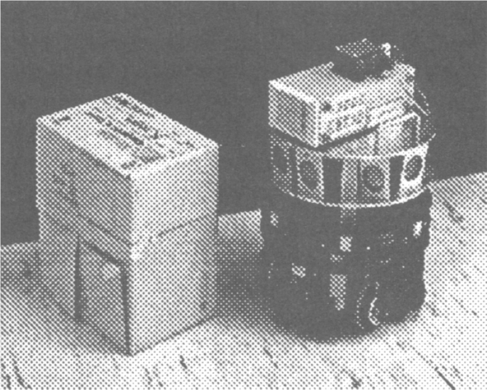

# Simulating OBELIX: A Behaviour-based Robot


**Picture:** *The figure shows the OBELIX robot examining a box, taken from the paper ["Automatic Programming of Behaviour-based Robots using Reinforcement Learning"](https://cdn.aaai.org/AAAI/1991/AAAI91-120.pdf)*


This repo consists of the code for simulating the OBELIX robot, as described in the paper ["Automatic Programming of Behaviour-based Robots using Reinforcement Learning"](https://cdn.aaai.org/AAAI/1991/AAAI91-120.pdf) by Sridhar Mahadevan and Jonathan Connell. The code is written in Python 3.7 and uses the [OpenCV](https://docs.opencv.org/4.x/) library for the GUI. 

*This repo is used for practicing RL algorithms covered during the NPTEL's course [Reinforcement Learning](https://onlinecourses.nptel.ac.in/noc19_cs55/preview) 2023.*

## Manual Gameplay

The game can be played manually by executing the `manual_play.py` file. The robot is controlled by the user using the keyboard. The following keys are used to control the robot:

| Key | Action |
| --- | --- |
| `w` | Move forward |
| `a` | Turn left (45 degrees) |
| `q` | Turn left (22.5 degrees) |
| `e` | Turn right (22.5 degrees) |
| `d` | Turn right (45 degrees) |

## Automatic Gameplay

The robot can be controlled automatically using the reinforcement learning algorithm described in the paper. The algorithm is implemented in the `robot.py` file. The algorithm is run by executing the `robot.py` file. The following command can be used to run the algorithm:

```python 
import argparse
import cv2

import numpy as np

from obelix import OBELIX


bot = OBELIX(scaling_factor=5)
move_choice = ['L45', 'L22', 'FW', 'R22', 'R45']
user_input_choice = [ord("q"), ord("a"), ord("w"), ord("d"), ord("e")]
bot.render_frame()
episode_reward = 0
for step in range(1, 2000):
    random_step = np.random.choice(user_input_choice, 1, p=[0.05, 0.1, 0.7, 0.1, 0.05])[0]
    # # random_step = np.random.choice(user_input_choice, 1, p=[0.2, 0.2, 0.2, 0.2, 0.2])[0]
    if x in user_input_choice:
        x = move_choice[user_input_choice.index(x)]
        sensor_feedback, reward, done = bot.step(x)
        episode_reward += reward
        print(step, sensor_feedback, episode_reward)
```

## Scope of Improvement

In the current implementation, the push feature explained in the paper is not implemented properly and the current push is more of an attach feature i.e. once the robot finds the box and gets attached to it, the box sticks to the robot and moves along with it. 

## References

- [Automatic Programming of Behaviour-based Robots using Reinforcement Learning](https://cdn.aaai.org/AAAI/1991/AAAI91-120.pdf)
